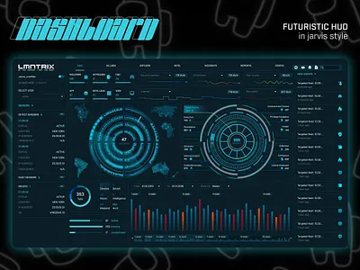

## Short description

Initialize J.A.R.V.I.S setup with a simple init version, using SQLite database a backend in python and front end application in vite.js.

## Context

We are building J.A.R.V.I.S, this project aims to build a highly complex personal assistant.
This assistant composed of multiple specialized agents (Daily orchestrator, Quarter EPIC manager, incident management expert etc.) aims to be deployed on a state of the art platform:
- Kubernetes as control plane
- vLLM and llm-d for GPU usage optimization
- Kubernetes Gateway API inference extension
- Industrialized agent relying on:
    - https://github.com/agentgateway/agentgateway
    - https://github.com/agentevals-dev/agentevals
    - https://github.com/agentregistry-dev/agentregistry
    - https://github.com/deliveryhero/asya
    - https://github.com/dapr/dapr-agents
    - https://github.com/dapr/dapr
    - https://github.com/kagent-dev/kagent
- RAG agent
And much more to build a re-usable and agentic assistant.

## Implementation details

### Chunk 1 - Intiialize the setup with minikube

For local setup, add initial setup create a makefile that allows to deploy a minikube instance on which we will be able to deploy JARVIS.

### Chunk 2 - Bootstrap the backend and front end

- Initialize the repository to integrate the backend in python
- Initialize the repository to integrate the front end in vite.js (v8.0.2)
- Initialise the repository to build and publish in Github the docker images for front end and backend
- Create Helm chart to deploy all the product on minikube (including SQLLite setup with local persistance)

### Chunk 3 - Front end theme
The idea is to have an interface futuristic and that respect accessibility rules (last version of WCAG), you can take inspiration of this image:

### Chunk 4 - Update CLAUDE.md

Following best practices redact a first version of CLAUDE.md file.