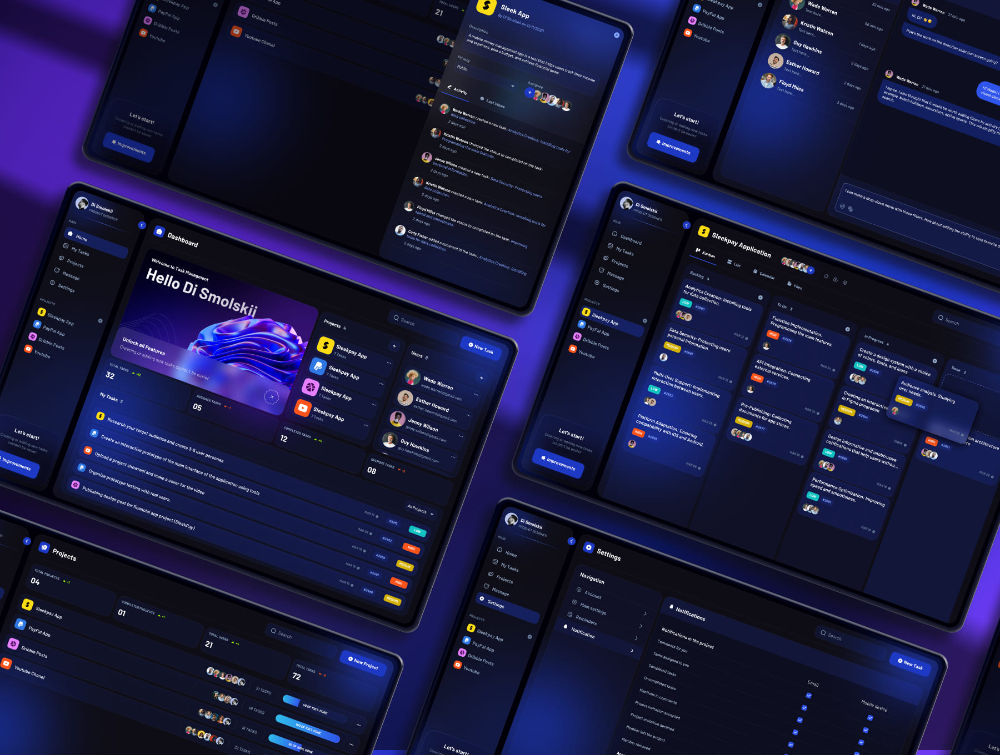
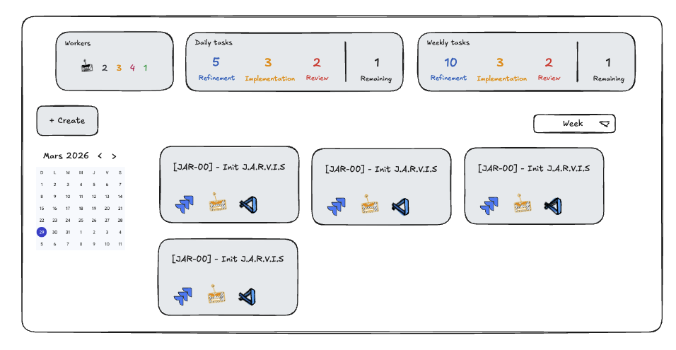
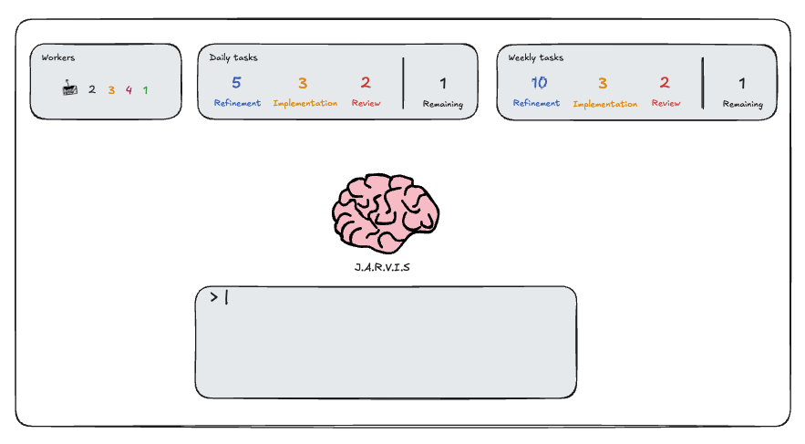

## Short description

Implement in J.A.R.V.I.S backend and front end the first feature: task management.

## Context

As an assistant J.A.R.V.I.S first job will be to help work organization through task management through a backlog of tasks, daily plannings grouping a set of tasks (and same task can be in multiple daily planning, weekly aggregate a view of all the task integrated for daily planning of the week).

## Implementation details

### Chunk 1 \- Backend integration with database

As a Python and Twelve-Factor app (https://12factor.net/) expert:

1.  Create integration between Backend and database through SQLAlchemy 2 \- Update the deployment to make it work with the SQLite already configured

### Chunk 2 \- ORM modelization within backend

The table management must be managed by the backend using ORM, with the following requirements:

* Use Pydantic 2.12.5 to manage all class definitions (MAKE IT a global project requirement, no dict usage all must be structured and well declared using a Python class with Pydantic)  
* SQLAlchemy as main solution to integrate with the Database  
* Use environment variables to make it easily configurable and rely on ConfigMap(s) and Secret(s) for deployment

We have the following python mode to implement:

* TaskType: string, possible values (not in database):  
  * refinement (Task to define of what is the need and needs to be implemented)  
  * implementation (Task to implement what was refined)   
  * review (Task to review what was implemented)  
* TaskStatus: string, possible values (not in database):  
  * created (Task is created)  
  * done (Task is done)  
* Weekly:  
  * id: integer (primary key \- auto incremental)  
  * week\_start: date, nullable: false, unique: true (First day of the week)  
  * dailies: relationship to Daily table (navigation property to “daily”)  
* Daily:  
  * id: integer (primary key \- auto incremental)  
  * date: date, nullable: false, unique: true (Day of the daily)  
  * weekly\_id: integer (foreign key: weekly.id, on delete: cascade)  
  * weekly: relationship to Weekly table (navigation property to “weekly”)  
  * tasks: relationship to DailyTask (navigation property to “dailyTask”)  
* Task:  
  * id: integer (primary key \- auto incremental)  
  * jira\_ticket\_id: String(20), nullable: true (Identifier of the Jira Ticket with the format XXX-YYY, XXX short name of the project and YYY the ticket number)  
  * title: Text, nullable: false (Title of the task)  
  * type: Enum(TaskType), nullable: false (Type of task)  
  * status: Enum(TaskStatus), nullable: false (Status of the ticket)  
  * daily\_entries: relationship to DailyTask table (navigation property to “dailyTask”)  
* DailyTasks  
  * daily\_id: integer (foreign key: daily.id, on delete: cascade)  
  * task\_id: integer (foreign key: task.id, on delete: cascade)  
  * daily: relationship to Daily table (navigation property to “daily”)  
  * task: relationship to Task table (navigation property to “task”)  
  * priority: integer, nullable: false (priority of the task in the daily planning, for the day \+ priority must be unique)

### Chunk 3 \- Front end theme \- guidelines

Get inspiration of this image for the theme of JARVIS:  

* Responsive  
* Follow the WCAG guidelines for accessibility : [https://www.w3.org/WAI/standards-guidelines/\#guidelines](https://www.w3.org/WAI/standards-guidelines/#guidelines)  
* Make the component generic as possible, to avoid unnecessary code duplication and improve reusability \- Create the “J.A.R.V.I.S design system” (aka J.A.D.S. \- Just A Design System), to only follow it for the front design, you should keep it updated with every new component. “J.A.D.S” is a dependency so you should package it and use it as a library.  
* Implement tests for every “critical”/”business” part of components, to avoid useless test cases, but for the component in “J.A.D.S” you should absolutely test the usage. Use Vitest 4.1.2.  
* “J.A.D.S” must come with a documentation that documents all the components with examples for each of them and how to use them, using StoryBook 10.3.  
* Implement Playwright, to create E2E tests.

### Chunk 4 \- Front end rendering for tasks

Task rendering:

* A task should contain the information as follow: \[\<JIRA ticket id\>\] \- \<task name\>  
* A task should have a clickable JIRA icon (use: [https://cdn.worldvectorlogo.com/logos/jira-1.svg](https://cdn.worldvectorlogo.com/logos/jira-1.svg)) enabling access to the JIRA ticket  
* Use three different colors to differentiate the type of task  
* Dim the task 

Task actions:

* A task can be deleted

### Chunk 5 \- Tasks board

Here is the mockup that you need to implement:  

Task management:

* Tasks can be re-ordered in a drag & drop mode (when moving a task animate it so that it makes a placeholder on the location before dropping) \-\> this action updates the priority of all the tasks changed.  
* Tasks can be created using the right button: To create a task you need to provide a JIRA ticket link (only the ticket id must be exposed), a title and one or multiple dates.  
* Task can be deleted  
* Task can be edited, and when editing you have the possibility to easily add the the current date as date for the task (Add to today planning)

Task filtering:

* Inspired from Google Calendar, on the left you have a calendar where you can navigate over the month and years (by default the selected date is today)  
* On the right above the tasks you have drop down list where you can select weekly, daily and all

By the union of the selected date in the calendar and the time range (drop down menu) enable to filter the the task that match (e.g for Thursday 2 april 2026 selected and weekly, it all the tasks from sunday 29 march to saturday 4 april)

Task grouping and ordering:

* Tasks are grouped by type (refinement, implementation, review)  
* Tasks are ordered by priority

### Chunk 6 \- JARVIS board

Here is the mockup that you need to implement:

The brain part should be follow the style/animation as this GIF:

- Header:  
- 3 blocks:  
  - Workers (mock nothing behind it for now): Metrics on the workers:  
    - Black \= idle \- worker is doing nothing  
    - Orange \= working \- worker is doing something  
    - Red \= needs intention \- worker needs attention / is waiting for user action  
    - Green \= done \- worker finished the task assigned  
  - Daily tasks: Metric on task for the current day  
    - Blue : number of task of type “refinement”  
    - Orange: number of task of type “implementation”  
    - Red: number of task of type “review”  
    - Black: all task remaining (not done)  
  - Weekly task: Same as Daily tasks but for the current week  
- The layout of the blocks (ordering) should be configurable per the user and saved from a session to another  
- Can be reduced task less space / the style change  (no text under metric and title of blocks replaced by their icon only)  
- Chat/Prompt section (mock nothing behind for now): Input to talk with agent / to prompt

### Chunk 7 \- MCP server

Create an MCP server that enables using an agent to interact with the tasks and daily planning (list, update, create, delete etc.)

### Chunk 8 \- CLAUDE.md update

Following best practices redact a first version of CLAUDE.md file.