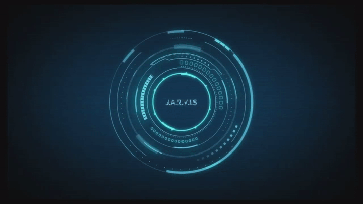

## Short description

Revamp J.A.R.V.I.S interface to match the Iron Man JARVIS HUD aesthetic: concentric rotating rings as the central element, holographic metric blocks in orbital positions, and a global futuristic style upgrade across the entire app and J.A.D.S design system.

**Reference:** 

## Context

The current Dashboard has 3 metric blocks in a top grid and a particle-network canvas (200 px) below it. The goal is to completely invert and upgrade this layout: the Brain becomes the dominant central element, the blocks orbit around it near-invisibly unless hovered, and the entire app — header, footer, background, and all J.A.D.S components — gets a HUD/holographic treatment.

**Technical constraints:**
- Plain CSS only (no Sass/SCSS) — coherent with existing codebase
- Vite 7.x + React 19 + TypeScript 5.9 stack unchanged
- All changes WCAG 2.2 AA compliant (contrast, keyboard navigation, focus indicators)
- The `BrainAnimation` canvas component must be completely replaced

---

## Chunk 0 — Global Futuristic Style (entire app + all J.A.D.S components)

### 0.1 — Floating particles background

Add a global `<ParticlesBackground />` canvas component rendered once in `App.tsx`, fixed to the viewport at `z-index: -1`.

**Specs:**
- 60–80 small particles (radius 1–2px), cyan `rgba(0, 212, 255, 0.25)`, slowly drifting (vx/vy ≤ 0.3 px/frame)
- Particles wrap around viewport edges (toroidal motion, no bounce)
- Reacts to `window.resize` to reinitialise positions
- Uses `requestAnimationFrame`, cleaned up on unmount
- Must NOT block pointer events below it

### 0.2 — App header & footer

Update `App.css` — the header and footer become semi-transparent glass panels:

**Header (`app-header`):**
- `background: rgba(11, 14, 26, 0.85)`, `backdrop-filter: blur(12px)`
- Bottom border: `1px solid rgba(0, 212, 255, 0.2)`
- Logo: add a subtle `text-shadow: 0 0 20px rgba(0, 212, 255, 0.6)` pulse animation (2s infinite)
- Nav links: on hover, add `color: var(--color-accent-cyan)` + `0 0 8px` glow

**Footer (`app-footer`):**
- Same glass background as header
- Top border: `1px solid rgba(0, 212, 255, 0.1)`

### 0.3 — J.A.D.S component upgrades (all 7 components)

Update the CSS of all 7 J.A.D.S components in `frontend/packages/jads/src/components/`:

| Component | Change |
|-----------|--------|
| **Card** | On hover: `border-color` → `rgba(0, 212, 255, 0.5)`, add `box-shadow: 0 0 16px rgba(0, 212, 255, 0.15)`. Top-left corner accent: a 12px × 12px cyan L-bracket pseudo-element (`::before`) |
| **Button (primary)** | Add scanner-line animation: a thin cyan line sweeping top→bottom on hover (using `::after` + `@keyframes`) |
| **Button (secondary/ghost)** | Border becomes dashed cyan on hover; glow pulse |
| **Input** | Bottom border only style (`border-top/left/right: none`, `border-bottom: 1px solid var(--jads-color-border)`). On focus: bottom border cyan + `box-shadow: 0 4px 12px rgba(0, 212, 255, 0.2)` |
| **Select** | Same HUD treatment as Input. Dropdown arrow: custom SVG chevron in cyan |
| **IconButton** | On hover: radial `box-shadow` glow + `border-radius: 50%`, border becomes cyan circle |
| **TaskCard** | Left accent bar (`border-left: 3px solid`) per task type color, pulsing subtly (opacity 0.7 → 1 @ 2s) |
| **Calendar** | Today cell: pulsing cyan outline (`outline: 1px solid var(--jads-color-accent-cyan)` + `box-shadow` keyframe at 1.5s). Hover cell: faint cyan fill |

**Acceptance criteria:**
- All existing Vitest tests still pass after CSS updates
- No new CSS custom properties added to components (use existing `--jads-*` tokens from `theme.css`)
- Add new tokens to `theme.css` only if required (e.g. glass blur variable)

---

## Chunk 1 — Brain: Concentric Rings HUD

### Goal
Replace the existing `BrainAnimation` canvas component entirely with a pure CSS + SVG implementation of concentric rotating rings, matching the Iron Man JARVIS HUD aesthetic.

### Layout change
The Dashboard layout changes from "blocks top, brain bottom" to "brain center, blocks orbital":

```
Dashboard HUD layout (desktop ≥ 1024px)
─────────────────────────────────────────────
          ┌──────────────────┐
          │  [Workers block] │   ← 12 o'clock (top-center)
          └──────────────────┘
                   ↑ ~40px gap from ring edge
        ╔══════════════════════╗
        ║  ── ─ ─ · · · ─ ─  ║  ← ring 5 (outermost, slow, CW)
        ║ ─                 ─  ║
        ║ · ╔══════════════╗ · ║  ← ring 4 (medium, CCW)
  ┌─────┐  ║  ·─────────·  ║  ┌─────┐
  │Daily│  ║ ·   ╔════╗  · ║  │Weekly│
  │Tasks│ ←║─·   ║time║  ·─║→ │Tasks │
  │     │  ║ ·   ╚════╝  · ║  │      │
  └─────┘  ║  ·─────────·  ║  └─────┘
   8 o'clk ║ ╚══════════════╝ ║  4 o'clk
        ║  ── ─ ─  · · ·  ─  ║
        ╚══════════════════════╝
─────────────────────────────────────────────
  [                 Chat input              ]
─────────────────────────────────────────────
```

### Brain technical spec

**Component:** Replace `BrainAnimation.tsx` and `BrainAnimation.css` entirely.

**Implementation: SVG rings + CSS `@keyframes`**

```
5 rings:
Ring 1 (innermost):  r = 18%  — no rotation — static glow ring
Ring 2:              r = 28%  — CW  0.8 rpm  — segmented arc dashes (stroke-dasharray)
Ring 3:              r = 38%  — CCW 0.5 rpm  — tick marks every 15°
Ring 4:              r = 48%  — CW  0.3 rpm  — sparse dashes + 4 rectangular notches
Ring 5 (outermost):  r = 58%  — CCW 0.15rpm  — dotted arc + small squares every 30°
```

**Visual details:**
- SVG viewBox `0 0 400 400`, `width: 100%`, `height: 100%` (responsive)
- All elements `fill: none`, `stroke: #00d4ff` with varying `stroke-opacity` (ring0: 0.9 → ring5: 0.5)
- `filter: drop-shadow(0 0 6px rgba(0, 212, 255, 0.7))` on the SVG element
- Background of the SVG area: a radial gradient — `radial-gradient(circle, rgba(0, 212, 255, 0.08) 0%, transparent 70%)`
- Each ring is a `<g>` with `transform-origin: 200px 200px` (SVG center) and a CSS animation class

**Center element:**
- A `<text>` element at (200, 200) centered: live digital clock `HH:MM:SS` updating every second via `useEffect` + `setInterval`
- Below it, a second `<text>`: date `DD MMM YYYY` (e.g. "06 APR 2026") in smaller lettering
- Both texts: `fill: #00d4ff`, `fontFamily: 'Inter, monospace'`, `letterSpacing: 2px`

**Ring 2 decoration (segmented arcs):**
- A `<path>` series of `M arc A arc` segments with 4px gaps between 8px dashes
- `stroke-width: 2`

**Ring 4 notches:**
- 4 small `<rect>` elements (4px × 10px) at 0°, 90°, 180°, 270° on the ring circumference
- `fill: #00d4ff`, `opacity: 0.8`

**Ring 5 small squares:**
- 12 small `<rect>` (3px × 3px) evenly spaced at 30° intervals

**CSS animations:** All defined in `BrainAnimation.css`
```css
@keyframes rotate-cw  { from { transform: rotate(0deg); }   to { transform: rotate(360deg); } }
@keyframes rotate-ccw { from { transform: rotate(0deg); }   to { transform: rotate(-360deg); } }
```

**Sizing:**
- Container: `width: min(60vmin, 500px)`, `height: min(60vmin, 500px)`
- Positioned at center of the HUD layout cell

**Accessibility:**
- SVG has `role="img"` and `aria-label="J.A.R.V.I.S brain animation — current time"` (updated with time)
- Clock text is also rendered in a visually-hidden `<time>` element outside the SVG for screen readers

### Dashboard HUD layout CSS

Implement the new orbital layout in `Dashboard.css`:

**Desktop (≥ 1024px):**
```
.dashboard__hud — CSS Grid:
  grid-template-areas:
    ". workers ."
    "daily brain weekly"
  grid-template-columns: 240px min(60vmin, 500px) 240px
  grid-template-rows: auto 1fr
  align-items: center
  justify-items: center
  gap: 32px
```

**Mobile (< 1024px):**  
Stack vertically: workers → brain → daily → weekly

**Orbital block visibility:**
- Default: `opacity: 0.08`, `transform: scale(0.95)`
- On hover of `.dashboard__hud` (includes brain + blocks): `opacity: 1`, `transform: scale(1)`
- Transition: `opacity 0.4s ease, transform 0.4s ease`
- **Fade-out delay:** `transition-delay: 1.2s` only on the non-hover state (so blocks stay visible long enough to click)

**DnD survives:** The 3 blocks are still wrapped in `DndContext` / `SortableContext`. Users can drag blocks between the 3 orbital slots (workers, daily, weekly). The orbital slots are fixed-named; the active block for each slot is determined by `blockOrder` state, same logic as before.

---

## Chunk 2 — Blocks: HUD Style & Hover Behavior

### MetricBlock HUD style

Update `MetricBlock` component and its CSS to look like a HUD data panel:

**Visual spec:**
- Background: `rgba(11, 14, 26, 0.75)`, `backdrop-filter: blur(8px)`
- Border: `1px solid rgba(0, 212, 255, 0.25)`, `border-radius: 4px` (sharper corners than current)
- Top-left and bottom-right: 8px cyan corner cut (`clip-path: polygon(8px 0%, 100% 0%, 100% calc(100% - 8px), calc(100% - 8px) 100%, 0% 100%, 0% 8px)`)
- Title bar: a `1px` top accent line in `rgba(0, 212, 255, 0.6)`
- Metric counts: `font-size: 2rem`, `font-weight: 700`, monospace, color by type (unchanged)
- Metric labels: `font-size: 0.65rem`, uppercase, letter-spacing 0.1em

**On hover of the block itself:**
- `border-color: rgba(0, 212, 255, 0.6)` + `box-shadow: 0 0 20px rgba(0, 212, 255, 0.2)`
- Redirect icon appears (current behavior unchanged)

### Compact toggle

Replace the toggle switch with a small HUD-style icon button (using `IconButton` from J.A.D.S):
```
[⊟] Compact  ←→  [⊞] Expanded
```
Position: top-right of the `.dashboard__hud` container.

---

## Acceptance Criteria

| Criterion | Expected |
|-----------|----------|
| Brain center | Brain occupies the viewport center at ≥1024px |
| Rings animate | 5 rings rotate at different speeds/directions continuously |
| Clock live | Center of brain shows `HH:MM:SS` updating every second |
| Orbital blocks | 3 blocks start at 8% opacity, reach 100% on hover of the HUD area |
| Fade-out delay | Blocks remain visible ≥1.2s after mouse leaves HUD area |
| DnD | Drag between orbital positions still reorders blocks |
| Particles bg | Floating particles visible on `/` and `/tasks` behind all content |
| J.A.D.S glow | Card hover glow + corner bracket visible in Storybook |
| Header glass | App header shows backdrop-filter blur on `/tasks` page |
| No Sass | Zero `.scss` files, no `sass` npm dependency |
| WCAG | `color-contrast` passes (existing tokens unchanged), clock text has `aria-label` |
| Mobile | Blocks stack vertically below brain at < 1024px |
| Tests | All existing Vitest + Playwright tests pass |
